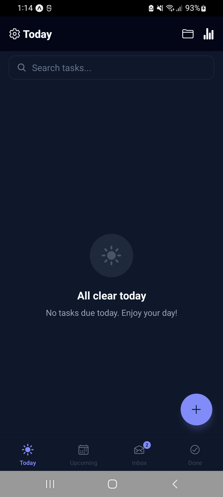
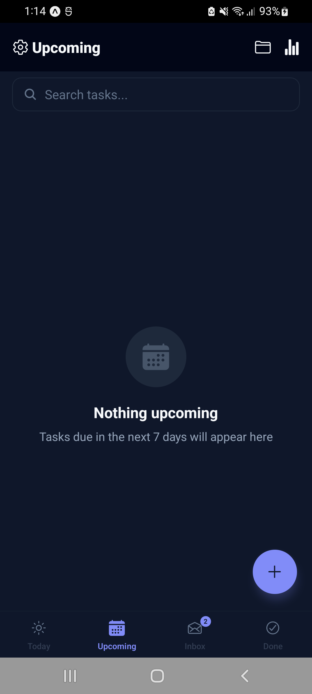
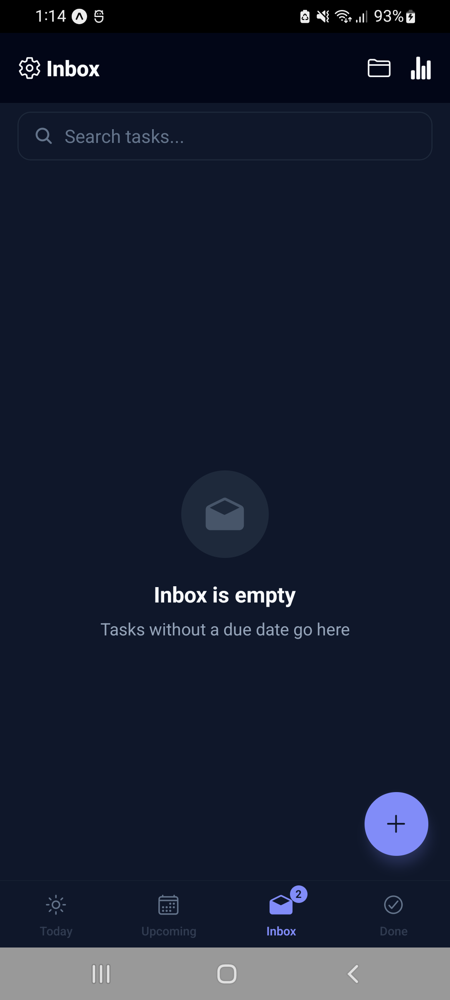
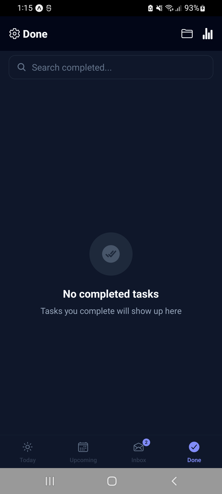
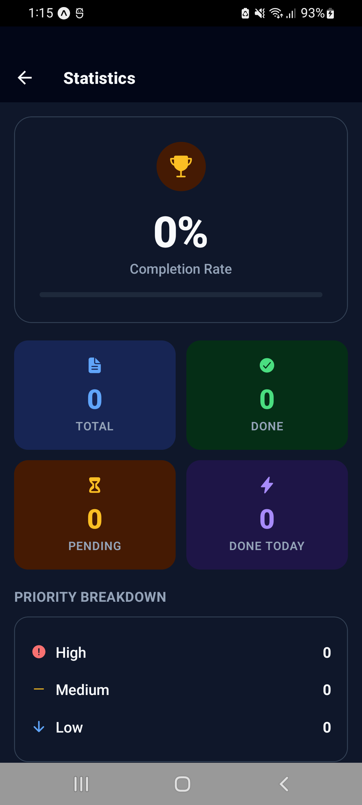

# 🚀 ZenithList
**Reach your peak productivity.**

ZenithList is a high-performance, local-first Todo application built for the modern mobile ecosystem. It prioritizes privacy, speed, and a minimalist user experience.

## ✨ Features
- **Local-First Architecture**: All data is stored on-device using AsyncStorage for maximum privacy and offline availability.
- **Smart Views**:
  - `Today`: Focus on immediate tasks.
  - `Upcoming`: Plan for the future.
  - `Inbox`: Capture everything.
  - `Completed`: Review your wins.
- **Task Organization**:
  - `Categories`: Group tasks by project or life area.
  - `Priority Levels`: High, Medium, and Low priority tagging.
  - `Recurring Tasks`: Automatically generate the next occurrence of a task.
- **Premium UI/UX**:
  - Minimalist design with React Native StyleSheet.
  - Fluid animations powered by Reanimated 3.
  - High-performance lists using @shopify/flash-list.
  - Dynamic Theming: Support for Light, Dark, and System modes.
  - Haptic Feedback: Tactile responses for a native feel.
- **Productivity Insights**: Visual dashboard to track completion rates and totals.
- **Local Reminders**: Scheduled notifications for due tasks.

## 📸 App Previews

| Today View | Upcoming View | Inbox View |
| :---: | :---: | :---: |
|  |  |  |

| Done View | Statistics View |
| :---: | :---: |
|  |  |

## 🛠 Tech Stack
- **Framework**: Expo SDK 56 (Managed Workflow)
- **Navigation**: Expo Router (File-based)
- **Styling**: React Native StyleSheet
- **State Management**: Zustand (with Persist middleware)
- **Database**: `@react-native-async-storage/async-storage`
- **Animations**: React Native Reanimated
- **Icons**: Lucide React Native
- **Date Handling**: date-fns
- **Haptics**: `expo-haptics`

## 🚀 Getting Started

### Prerequisites
- Node.js (LTS)
- Expo Go app on your device or an Android/iOS emulator.

### Installation
 1. **Clone the repository**:
    ```bash
    git clone https://github.com/MK-ayaz/ZenithList.git
    cd ZenithList
    ```


2. **Install dependencies**:
   ```bash
   npm install
   ```

3. **Start the development server**:
   ```bash
   npx expo start
   ```

## 📦 Production Build & Deployment

### Build via EAS
```bash
# Install EAS CLI
npm install -g eas-cli

# Login to Expo
eas login

# Configure build
eas build:configure

# Build for Android
eas build --platform android --profile production

# Build for iOS
eas build --platform ios --profile production
```

## 🎨 Assets Guide
The following assets are required for a production-ready build. Place them in the `assets/` directory:

| Asset | File Name | Dimension | Description |
| :--- | :--- | :--- | :--- |
| **App Icon** | `icon.png` | 1024x1024 | Main home screen icon |
| **Adaptive Icon** | `adaptive-icon.png` | 1024x1024 | Android foreground image |
| **Splash Screen** | `splash.png` | 2048x2048 | Launch screen image |

## 📂 Project Structure
```
app/            # Expo Router screens and layouts
src/
├── components/ # UI and Feature components
├── hooks/      # Custom React hooks
├── services/   # Notification and utility logic
├── stores/     # Zustand state stores
├── types/      # TypeScript definitions
└── utils/      # Date helpers and theme constants
```
